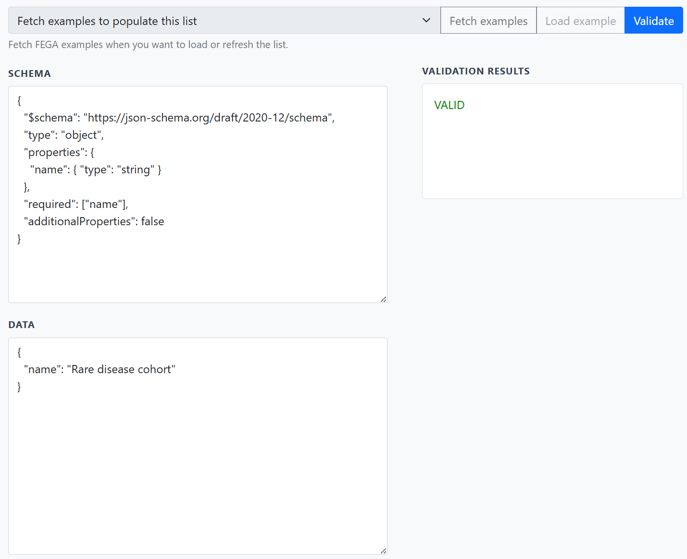

# Exercise 1 - Validate a minimal entity

## Goal

Validate a small Cohort entity and distinguish its schema from its data.

## Instructions

1. Open [Biovalidator](http://localhost:3020). Paste this into its schema input.

```json
{
  "$schema": "https://json-schema.org/draft/2020-12/schema",
  "type": "object",
  "properties": {
    "name": { "type": "string" }
  },
  "required": ["name"],
  "additionalProperties": false
}
```

2. Paste this into its data input and validate it.

```json
{
  "name": "Rare disease cohort"
}
```

> It should look something like the following:


3. Paste this into its data input and validate it again.

```json
{
  "name": true
}
```

## Questions

1. Which part says that `name` **must** be present?
2. Why is one value valid but not the other?

> **In the real repository:** this is a simplified version of [`schemas/entities/cohort/schema.json`](https://github.com/M-casado/fega-metadata-schema/blob/f59d931f0db9eb4c6cc2e556d00dafcce14281f6/schemas/entities/cohort/schema.json).

<details>
<summary>Solution</summary>

1. `"required": ["name"]` is the part that makes `name` required.
2. The second is not valid because `name` must have `"type": "string"`, but `true` is a Boolean.

</details>
