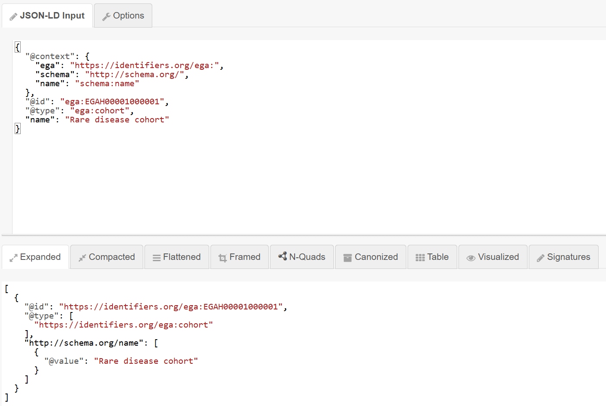

# Exercise 5 - Add JSON-LD meaning

## Goal

Use a context to give JSON names shared meanings.

## Instructions

1. Open the [JSON-LD Playground](https://json-ld.org/playground/). Paste this document into the JSON-LD input.

```json
{
  "@context": {
    "ega": "https://identifiers.org/ega:",
    "schema": "http://schema.org/",
    "name": "schema:name"
  },
  "@id": "ega:EGAH00001000001",
  "@type": "ega:cohort",
  "name": "Rare disease cohort"
}
```

2. Select the **Expanded** tab. It should look like the following:


3. Replace the JSON-LD input with this version, which has no mapping for `name`. Then check the **Expanded** tab again.

```json
{
  "@context": {
    "ega": "https://identifiers.org/ega:",
    "schema": "http://schema.org/"
  },
  "@id": "ega:EGAH00001000001",
  "@type": "ega:cohort",
  "name": "Rare disease cohort"
}
```

## Questions

1. Which entries in the context are prefixes?
2. What happens to `name` after its mapping is removed? How does that affect the meaning available to a machine?

> **In the real repository:** the [shared context maps `name`](https://github.com/M-casado/fega-metadata-schema/blob/f59d931f0db9eb4c6cc2e556d00dafcce14281f6/schemas/common/context.jsonld#L3-L5) and defines the [`ega` and `schema` prefixes](https://github.com/M-casado/fega-metadata-schema/blob/f59d931f0db9eb4c6cc2e556d00dafcce14281f6/schemas/common/context.jsonld#L69-L75).

<details>
<summary>Solution</summary>

1. `ega` and `schema` are prefixes. JSON-LD replaces them with their full values during expansion.
2. With the mapping, `name` expands to `http://schema.org/name`. Without the mapping, `name` has no absolute meaning and disappears from the expanded output. If there is no expanded `name`, then a _machine_ reading the code cannot understand that `name` is not just a string, but it has the semantic meaning of `https://schema.org/name`.

</details>
