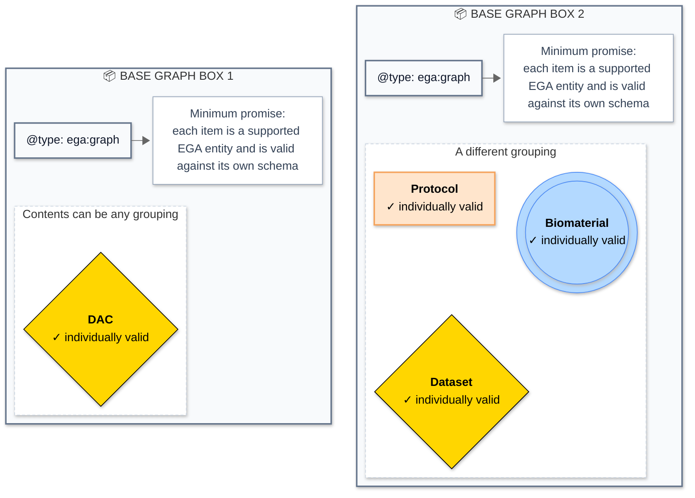

# Exercise 1 - Put entities in a graph box

## Goal

We will use the _box_ analogy to understand an ``ega:graph``. The graph is one named JSON-LD container, and its `@graph` array is _a box_ that can hold different kinds of named EGA entities.

## Prerequisites

- Start Biovalidator using the [setup instructions](../../README.md#setup).
- Open <http://localhost:3020>.

## Instructions

1. In Biovalidator, choose **Fetch examples**, select `graph-valid-minimal.json`, and choose **Load example**.
2. Inspect **SCHEMA**. Think about what schema is _really_ applied when the remote file is fetched by Biovalidator (_Hint_: check exercise [``4-resolve-a-relative-ref.md``](../json-schema/04-resolve-a-relative-ref.md)).
3. Inspect **DATA**. Take a look at the content, level by level, of the JSON data. To aid you, search using `Ctrl+F` for these unique anchors (one row at a time):

   ```text
   "@type": "ega:graph"
   @graph
   "@type": "ega:DAC"
   ```
4. Choose **Validate**.

## Questions

1. Which field identifies the graph, and which field identifies each item inside it?
2. How many top-level objects are in the **DATA**?
3. How many objects are encompassed by the graph?
4. If the result of the validation is ``VALID``, what does that mean about the graph and its contents?

<details>
<summary>Solution</summary>

1. The graph and each item inside the ``@graph`` _box_ are identified by their `@id` fields. The graph's `@type` value is `ega:graph`; each item's `@type` specifies the EGA entity class it represents (e.g., `ega:DAC` or `ega:Dataset`).
2. Technically there is a single object in the top-level of the **DATA**: the graph itself (``ega:EGAG00000000001``).
3. The graph encompasses a single object in this example, as there is only one item in its `@graph` array: the `ega:DAC` object with the identifier `ega:EGAC00000000001`.
4. If the result of the validation is ``VALID``, it means that the whole graph itself is valid according to the schema. That includes all nodes inside its ``@graph``, which means that each item inside the graph (in this case, the `ega:DAC` object) is also valid according to its respective schema (i.e., the [DAC schema](https://github.com/EGA-archive/fega-metadata-schema/blob/main/schemas/entities/DAC/schema.json)). In other words, both the container (the graph) and its contents (the individual entities) conform to the defined rules and constraints of their schemas.

</details>

## Concept summary

Think of a graph as a box for an EGA bundle. The box gives the validator one document to inspect, and then each item inside tells the validator what rules to apply based on their respective types. For example, if an item in the box is of type `ega:DAC`, the validator will apply the rules for a DAC to that individual item (see exact lines [here](https://github.com/EGA-archive/fega-metadata-schema/blob/4d8909ec67e8a1435aee13de93ac7b9a14d53cb1/schemas/graph/schema.json#L343-L351)). The graph itself does not impose any specific requirements on what types of items must be present: it simply groups them together for validation.



Each outlined graph is only a grouping container: it can hold whichever entities belong in that bundle. The combinations can differ, even repeating an entity type, because a graph does not prescribe a fixed layout. Whoever adds items to the ``@graph`` is, in effect, making a choice about which entities to group together. For example, EGA can use graphs to group all items that relate to a submission, and then validate it. In this scenario it is you who is making the groupings as you want.
