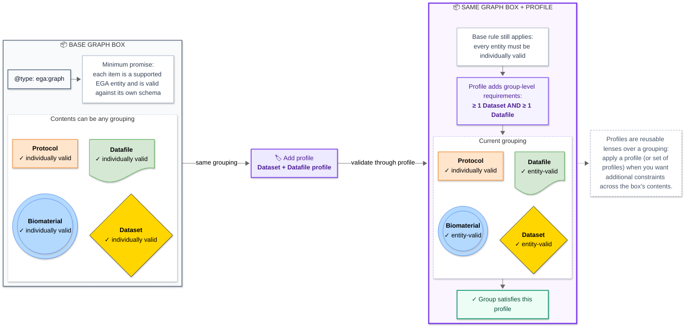

# Exercise 3 - Pass the graph box through a profile

## Goal

See a profile as a **small, modular set of extra constraints** for the whole _box_ (i.e., the `@graph` array). You can apply any profile to a graph at any point; the profile does not replace the individual entity schemas.

In an EGA workflow, someone can add entities to a box and validate each one with its individual schema while building it. In practice, this tool would be used most times by EGA to validate the relevant EGA profile when a submitter marks the submission as complete.

## Prerequisites

Complete [Exercise 2](02-see-what-the-bare-graph-schema-checks.md). Leave Biovalidator running.

## Instructions

1. Open the [valid Organism Lab Data graph example](https://github.com/EGA-archive/fega-metadata-schema/blob/main/schemas/graph/examples/valid/graph-valid-organism-lab-data.json).
2. Copy the [example's ``schema`` content](https://github.com/EGA-archive/fega-metadata-schema/blob/4d8909ec67e8a1435aee13de93ac7b9a14d53cb1/schemas/graph/examples/valid/graph-valid-organism-lab-data.json#L2-L4) into the **SCHEMA** input field of Biovalidator:
   ```
   {
      "$ref": "https://raw.githubusercontent.com/EGA-archive/fega-metadata-schema/main/schemas/graph/profiles/organism-lab-data.schema.json"
   }
   ```

   Now copy the [example's whole `data` content](https://github.com/EGA-archive/fega-metadata-schema/blob/4d8909ec67e8a1435aee13de93ac7b9a14d53cb1/schemas/graph/examples/valid/graph-valid-organism-lab-data.json#L5-L95) (_not just the snippet below!_) into the **DATA** input field:

   ```
   {
      "@context": "https://raw.githubusercontent.com/EGA-archive/fega-metadata-schema/main/schemas/graph/context.jsonld",
      "@id": "ega:EGAG00000000004",
      "@type": "ega:graph",
      "@graph": [
         {
         "@id": "ega:EGAN00000000004",

      ...
   }
   ```

3. Choose **Validate**. The complete four-entity graph should pass.
4. Open the [profile schema](https://github.com/EGA-archive/fega-metadata-schema/blob/main/schemas/graph/profiles/organism-lab-data.schema.json) that we are referencing above and find its `allOf` block. Notice how it is combining the bare graph schema with some other reusable requirements (e.g., `../schema.json#/$defs/hasOrganismBiomaterial` requires at least one biomaterial in the graph):

   ```json
   "allOf": [
     { "$ref": "../schema.json" },
     { "$ref": "../schema.json#/$defs/hasOrganismBiomaterial" },
     ...
   ]
   ```

5. In **DATA**, find the biomaterial's node. The one that starts like this:

   ```text
    {
      "@id": "ega:EGAN00000000004",
      "@type": [
        "ega:biomaterial",
   ...
   ```

   And ends like this:

   ```text
   ...
      "inSubmission": {
        "@id": "ega:EGAB00000000004",
        "@type": "ega:submission"
      }
    },
   ```
   Delete that item from the `@graph` array, so that the box no longer has a biomaterial.
6. Choose **Validate**. The validation should fail because the profile requirements are not met by the data.
7. For comparison, in **SCHEMA** replace only the `$ref` value with the bare graph schema URL below. Leave the changed **DATA** unchanged:

   ```json
   {
     "$ref": "https://raw.githubusercontent.com/EGA-archive/fega-metadata-schema/main/schemas/graph/schema.json"
   }
   ```

   Choose **Validate** again. The bare graph schema should pass. Why?

## Questions

1. Why can the modified DATA (without the biomaterial node) pass validation of the [bare graph schema](https://github.com/EGA-archive/fega-metadata-schema/blob/main/schemas/graph/schema.json) but fail the schema that was pointing to the [profile](https://github.com/EGA-archive/fega-metadata-schema/blob/main/schemas/graph/profiles/organism-lab-data.schema.json)?
2. When is it useful to apply a profile? Can you apply one before a graph bundle is marked complete?
3. How does `allOf` keep profile rules modular? How is this useful for the EGA and other stakeholders?

<details>
<summary>Solution</summary>

1. The bare schema checks the items in the `@graph` array as individual entities. Additionally to that minimum promise, the profile also requires a node in the graph whose type is a biomaterial.
2. A profile can be applied whenever a check is useful. At any point in time, one can validate the bundle of items in the graph with any profile. That can be at the beginning of a submission, half-way through, or at the end. Most commonly, these profiles would be used at the end of a metadata submission to assert that all the items in a submission, both individually and as a group, are complete and meets the requirements of a particular workflow.
3. `allOf` composes the reusable base graph rules and `has...` requirements. This way, the profile adds constraints without copying the entity definitions. This is extremely useful for EGA to easily make profiles, and for other stakeholders (e.g., an EGA submitter with particular submission requirements) to either reuse similar profiles or to build their own.

</details>

## Concept summary

A profile is a _filter_ you can pass the graph _box_ through when you need to ask, "is this box compatible with these particular requirements?"

You can keep adding and individually validating entities first, then apply the profile when you want the whole-box answer.


