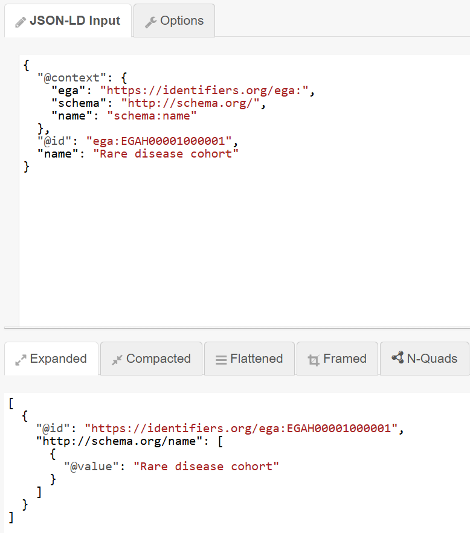

# Exercise 1 - Add JSON-LD meaning

## Goal

You will use a context to give ordinary JSON names and short prefixes a shared meaning.

## Prerequisites

- Complete the first four [JSON Schema exercises](../json-schema/).

## Instructions

1. Open the [JSON-LD Playground](https://json-ld.org/playground/).
2. Paste this exact document into the **JSON-LD input**:

    ```json
    {
      "@context": {
        "ega": "https://identifiers.org/ega:",
        "schema": "http://schema.org/",
        "name": "schema:name"
      },
      "@id": "ega:EGAH00001000001",
      "name": "Rare disease cohort"
    }
    ```

3. Select **Expanded**. This shows the full names behind the short names. It should look similar to the following:


4. Replace the JSON-LD input with this version, which has no mapping for `name`. Then check the **Expanded** tab again.
    ```json
    {
      "@context": {
        "ega": "https://identifiers.org/ega:",
        "schema": "http://schema.org/"
      },
      "@id": "ega:EGAH00001000001",
      "name": "Rare disease cohort"
    }
    ```


5. See how removing that line alters the result of the **Expanded** tab.

## Questions

1. Which entries are short prefixes (_hint: look for a format similar to ``"prefix:suffix"``_)?
2. What happens to `name` in the **Expanded** tab _after_ you remove its mapping in ``@context``?

> **In the real repository:** see the [shared EGA context](https://github.com/EGA-archive/fega-metadata-schema/blob/main/schemas/common/context.jsonld).

<details>
<summary>Solution</summary>

1. `ega` and `schema` are short prefixes. 

    The JSON-LD playground understands that when you type them (e.g., ``ega:``), you are referring to the full URIs (e.g., ``https://identifiers.org/ega:``), so it expands them to full web identifiers along with the suffix. That makes ``schema:name`` be expanded to ``http://schema.org/name``, or ``ega:EGAH00001000001`` be expanded to ``https://identifiers.org/ega:EGAH00001000001``.

2. Without the mapping, `name` has no full meaning. It becomes _just another string_, so the tool does not include it in the expanded result.

    Note, however, that the property ``name`` remains in the **JSON-LD Input**: it is not removed, it simply is not expanded because the tool lacks its context.

</details>

## Concept summary

You can think of a JSON-LD context as a **small translation dictionary**. It maps short JSON terms to shared web identifiers.

Different tools can then understand the same data without every document spelling out long names.

This way, property names stop being random strings without meaning for computers, and turn instead into uniquely identified concepts. For example, without context, ``name`` has the same meaning for a _computer_ as ``143Xyawd3``, but by adding context, we are giving a unique meaning to ``name`` that becomes interoperable.
