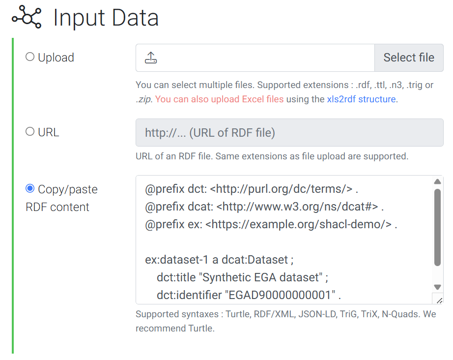
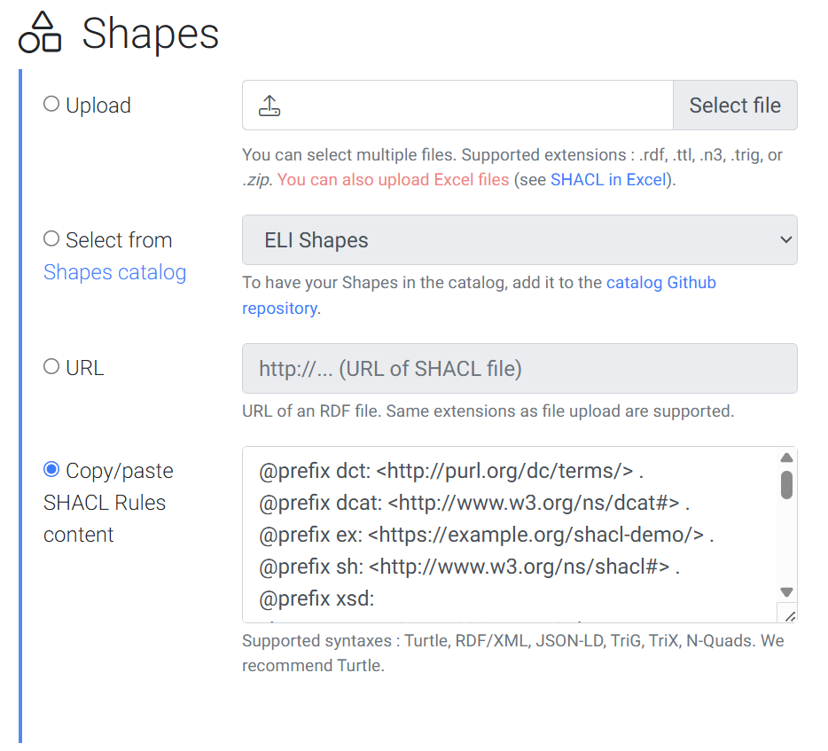
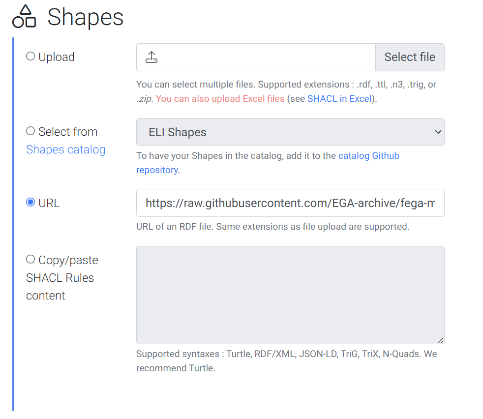

# Exercise 1 - Run a SHACL check in the browser

## Goal

You will check a small RDF graph against SHACL shapes in your browser. SHACL is a language for writing rules about RDF graphs.

You will first use a shape you can read. Then you will use the EGA HealthDCAT-AP shapes without installing a validator.

## Prerequisites

- Have a web browser.
- Use only the synthetic data in this exercise; do not paste controlled-access data into a public service.

## Instructions

1. Open [SHACL Play!'s validator](https://shacl-play.sparna.fr/play/validate) (free web tool).

1. Validate a small graph:

    1. Under **Input Data**, click on **Copy/paste RDF content**, and then paste the block below into its input box:

        ```turtle
        @prefix dct: <http://purl.org/dc/terms/> .
        @prefix dcat: <http://www.w3.org/ns/dcat#> .
        @prefix ex: <https://example.org/shacl-demo/> .

        ex:dataset-1 a dcat:Dataset ;
            dct:title "Synthetic EGA dataset" ;
            dct:identifier "EGAD90000000001" .
        ```

        

        Then, under **Shapes**, click on **Copy/paste SHACL Rules content** and then paste the block below into its input box:

        ```turtle
        @prefix dct: <http://purl.org/dc/terms/> .
        @prefix dcat: <http://www.w3.org/ns/dcat#> .
        @prefix ex: <https://example.org/shacl-demo/> .
        @prefix sh: <http://www.w3.org/ns/shacl#> .
        @prefix xsd: <http://www.w3.org/2001/XMLSchema#> .

        ex:DatasetShape a sh:NodeShape ;
            sh:targetClass dcat:Dataset ;
            sh:property [
                sh:path dct:title ;
                sh:minCount 1 ;
                sh:datatype xsd:string
            ] ;
            sh:property [
                sh:path dct:identifier ;
                sh:minCount 1 ;
                sh:datatype xsd:string
            ] .
        ```
        

    2. Leave other boxes unchecked (default) and click on **VALIDATE**. Confirm that the graph passes. 
    
    3. Delete the following line from the **Input Data**:
        ```turtle
            dct:title "Synthetic EGA dataset" ;
        ```
    
        Then click on **VALIDATE**. Read the report and understand why it failed.

2. Load the EGA rules from a fixed URL

    1. In **Input Data** paste again the initial content that you used at the beginning of this exercise.

    2. Now, instead of pasting the shapes' content as well, in **Shapes**, choose **URL** and paste this fixed HealthDCAT-AP shape-file URL into its box:

    ```text
    https://raw.githubusercontent.com/EGA-archive/fega-metadata-schema/main/standards/rdf/healthdcat-ap/release-6.0.0/shacl/non-public-shapes-v6.ttl
    ```
    

    3. Choose **Validate** and read the report.
    
        All of these violations that the report contains highlight a requirement that HealthDCAT-AP ([v6](https://healthdataeu.pages.code.europa.eu/healthdcat-ap/releases/release-6/index.html) in this case) requires for a record of type ``"dcat:Dataset"``.

## Questions

1. What kind of data is SHACL checking?
2. Which rules did you use in step 1, and which rules did you load in step 2?
3. Do all EGA entities have SHACL shapes (i.e., rules) besides JSON Schemas?
4. How is this check different from JSON Schema validation in Biovalidator?

> **In the real repository:** see the [SHACL validation instructions](https://github.com/EGA-archive/fega-metadata-schema/blob/main/README.md#rdfshacl-example-suite), the [validation script](https://github.com/EGA-archive/fega-metadata-schema/blob/main/scripts/py/validate_rdf_shacl.py), and the [HealthDCAT-AP shapes](https://github.com/EGA-archive/fega-metadata-schema/blob/main/standards/rdf/healthdcat-ap/release-6.0.0/shacl/non-public-shapes-v6.ttl). If we add ``dcat:Dataset`` as one of the ``@type`` items in EGA's dataset records (see [example](https://github.com/EGA-archive/fega-metadata-schema/blob/4d8909ec67e8a1435aee13de93ac7b9a14d53cb1/schemas/entities/dataset/examples/valid/dataset-valid-minimal-non-public.json#L10)), and validate the content with these SHACL shapes, we would be able to assert whether the data complies with the HealthDCAT-AP (v6) standard or not. This validation is automated in the repository for all dataset examples (see [runs](https://github.com/EGA-archive/fega-metadata-schema/actions/workflows/rdf_shacl.yml)).

<details>
<summary>Solution</summary>

1. SHACL checks an RDF graph: data written as linked facts. It does not check that the original JSON data is valid against the EGA JSON Schemas.
2. Step 1 uses the small rules you pasted. Step 2 uses the HealthDCAT-AP release-6.0.0 shape file, which contains many more requirements.
3. No. SHACL Shapes are only added as an extra layer of verification against the HealthDCAT-AP standard. This standard does not pertain to entities like biomaterials or protocols, and thus there are not additional layers to apply beyond the DCAT-compatible EGA entities (e.g., Dataset).
4. JSON Schema checks the structure and values in a JSON document. SHACL checks linked facts in an RDF graph. JSON-LD can connect the two views.

   Passing one check does not automatically mean passing the other.

</details>

## Concept summary

JSON Schema and SHACL are two sets of rules for two views of metadata. JSON Schema works on your JSON document. SHACL works after that data is read as an RDF graph.

The browser tool lets you see the difference: paste the data and rules, run the check, and read the report. Passing one check does not automatically mean passing the other.
